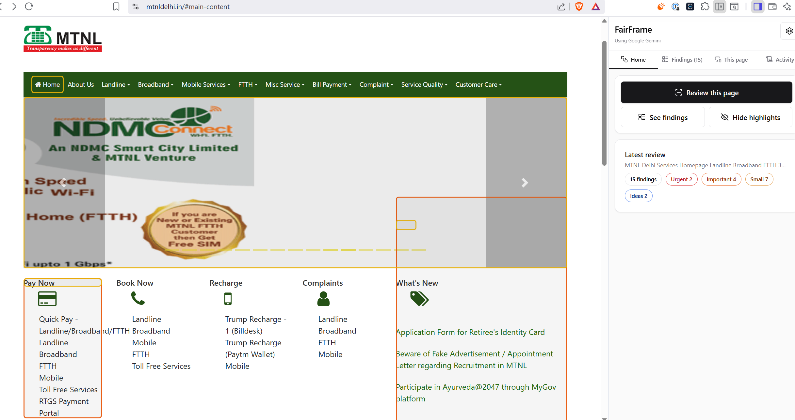
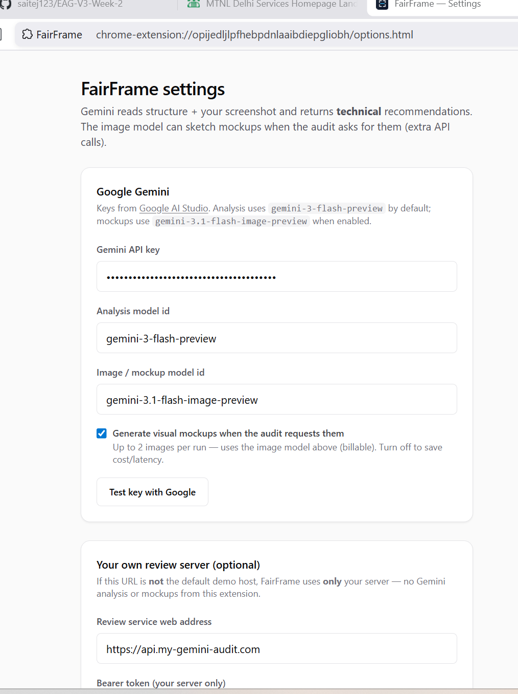
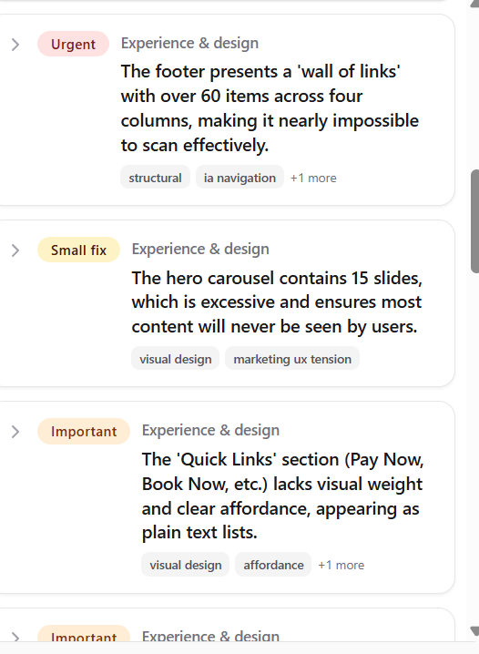
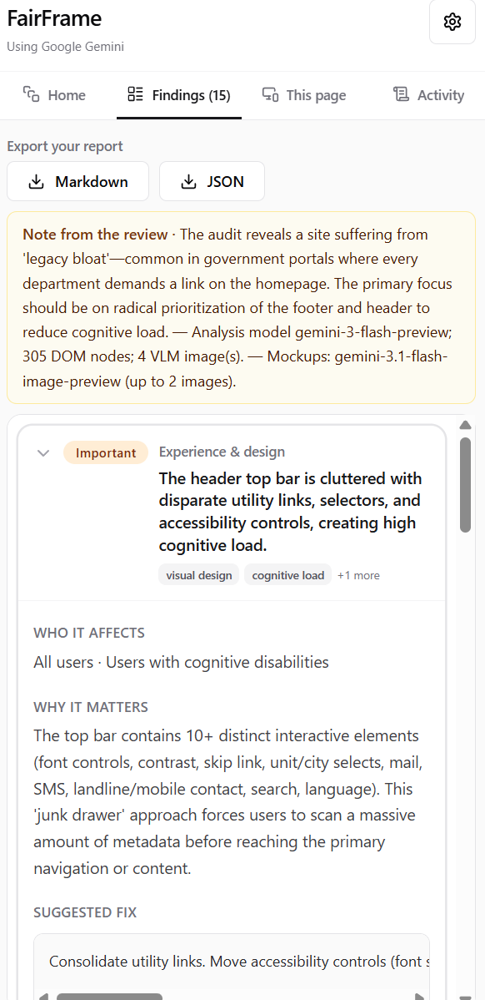
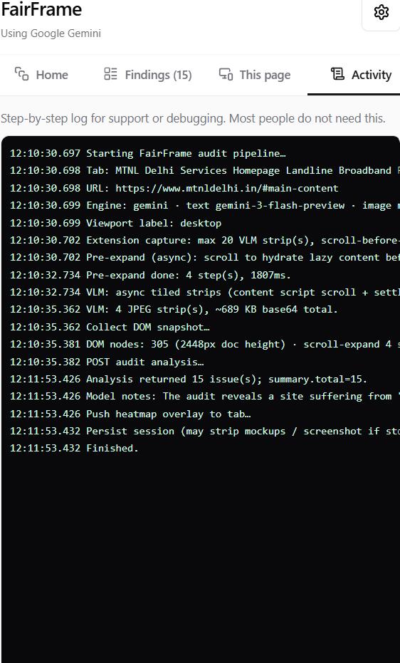

# FairFrame

> **A calm second pair of eyes for any webpage** — layout, usability, accessibility, and content, with optional AI mockups and highlights right on the page.

FairFrame lives in Chrome’s **side panel**. Open the tab you care about, run a review, and read **plain-language findings** you can share or export.

---

## Screenshots

**`2.png`** is a wide browser screenshot (full row). **`1`**, **`3`**, **`4`**, and **`5`** are taller side-panel shots, shown in pairs. On GitHub and in most previews, images scale to the page width. Replace files under `Images/` when you refresh captures.



*Full window / page context*

|  |  |
| :---: | :---: |
|  |  |
|  |  |

---

## What you get

|  |  |
| :--- | :--- |
| **Review** | Looks at what’s on screen and how the page is built, then suggests improvements — not just a dry checklist. |
| **Highlights** | Optional boxes on the page so you can see *where* each finding applies. |
| **History** | Remembers recent runs on the same URL so you can see what might have changed. |
| **Export** | Download a **Markdown** or **JSON** report for tickets, docs, or your team. |

**Default engine:** [Google Gemini](https://ai.google.dev/) (you add your own API key).  
**Alternative:** Point FairFrame at **your own server** — then Gemini is not used.

---

## Quick start

1. **Clone / open this project** and install dependencies:

   ```bash
   npm install && npm run build
   ```

2. In Chrome, open **`chrome://extensions`**, turn on **Developer mode**, click **Load unpacked**, and choose the **`dist`** folder.

3. Open **FairFrame** from the extensions menu or side panel. Add your **Gemini API key** ([get one free](https://aistudio.google.com/apikey)) when asked.

4. Visit any normal website, open the side panel, and tap **Review this page**.

**Keyboard shortcut:** set **Run FairFrame review** under `chrome://extensions/shortcuts`.

---

## Settings (simple)

- **API key** — Required when using the default Gemini setup. You can also put `GEMINI_API_KEY=...` in a project **`.env`** file; `npm run build` copies it into a local config file the extension can read **only if** you have not saved a key in Chrome yet (saved key always wins).
- **Models** — Defaults are set in the project; you can override in the options page. Preview model names change over time — see [Gemini models](https://ai.google.dev/gemini-api/docs/models).
- **Mockups** — Optional AI-generated **picture ideas** for some findings (extra API calls). Toggle in settings.
- **Custom URL** — If you use your own review API instead of the demo host, FairFrame sends the capture there and does **not** call Gemini.

---

## Privacy (short)

FairFrame reads **the active tab** you choose to review. Data stays on your machine except when you use **Gemini** or **your configured server**. See [Google AI terms](https://ai.google.dev/terms) for Gemini.

---

## For developers

| Command | Purpose |
| :--- | :--- |
| `npm run typecheck` | TypeScript |
| `npm run verify` | Build + quick extension sanity check |
| `npm run icons` | Regenerate PNG icons from `public/icons/icon-source.svg` |

**Main code paths:** `src/background/index.ts`, `auditApi.ts`, `geminiAudit.ts`, `fullPageCapture.ts`, `auditRunHistory.ts`, `src/content/auditDom.ts`, `src/sidepanel/App.tsx`.

**Bundled config**

- `public/fairframe.config.json` — optional tuning (models, capture limits, scroll behavior); copied to `dist/`. Legacy filename `webmacaw.config.json` is still accepted if present.
- `public/config.local.json` — generated from `.env` during build (gitignored); dev-only Gemini key fallback.

**Gemini responses** use JSON mode and, when supported, a **response schema**; the client strips markdown fences and extracts a root JSON object if the model adds extra text. See [Structured output](https://ai.google.dev/gemini-api/docs/structured-output).

---

<p align="center"><strong>FairFrame</strong> · Chrome extension · MV3</p>
